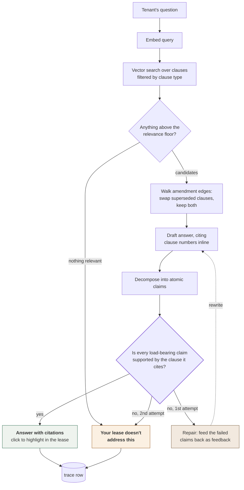
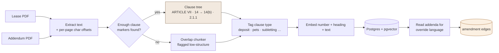
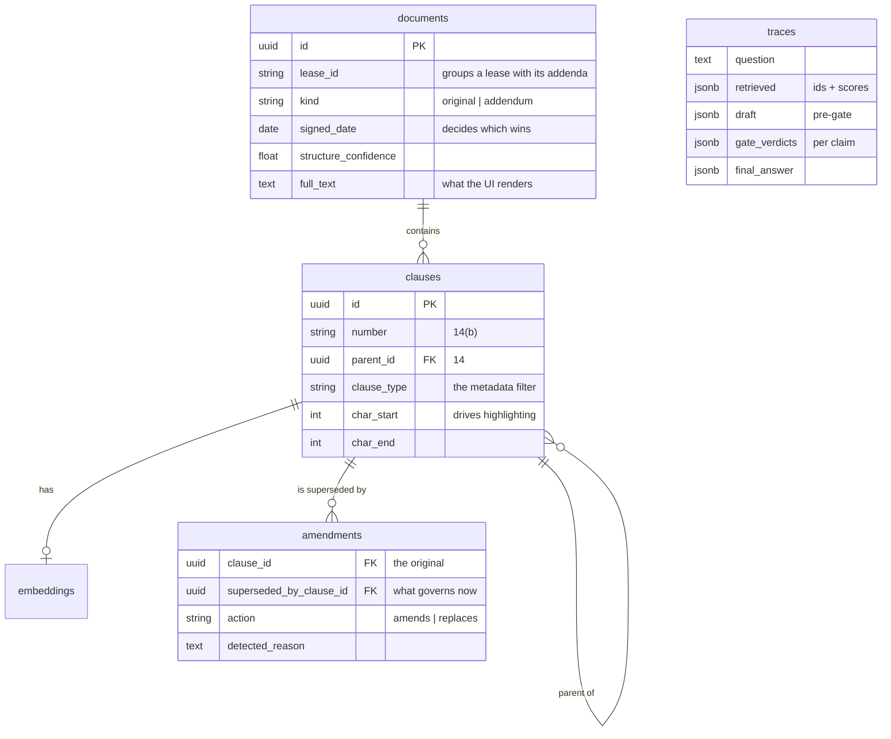

# FinePrint

Ask your lease the questions you never read it for.

A RAG assistant for rental agreements — deposits, subletting, guests, late fees — where
every answer cites the exact clause, and the system refuses when the lease simply doesn't say.

The failure that matters isn't "no answer." It's telling a tenant they *can* sublet when
clause 14(b) says they can't. Everything here is designed backwards from that failure mode.

## What makes it not a tutorial RAG

| | |
|---|---|
| **Clause-aware ingestion** | A clause *tree* (`14` → `14(b)`), not fixed token windows. Splitting a clause from its exceptions retrieves half-truths. |
| **Amendment-aware retrieval** | An addendum signed months later silently overrides the clause retrieval just found. Override edges live in Postgres and retrieval prefers the version that governs. |
| **Grounding gate** | Every claim in a drafted answer is checked back against the clause it cites, semantically. Unsupported answers are downgraded to "not found in your lease" rather than shipped with a correct-looking citation. |
| **Replayable traces** | One row per request: question, retrieved clauses + scores, pre-gate draft, per-claim verdicts, final answer. "It said something weird about my deposit" is a bug report you can actually run. |
| **Refusal evals** | The most valuable cases are the ones whose correct answer is "the lease doesn't say" — plus adversarial cases where an addendum changed the answer and citing the original clause is a wrong answer with a right-looking citation. |

## How a question gets answered

Two things here don't appear in a standard RAG diagram, and both exist because
of the failure mode above. **The override walk runs after vector search, not
inside it** — search will always rank the original clause highest, because it's
longer, more topical, and written in the vocabulary the question uses; the walk
then swaps in whatever superseded it and keeps both. **The gate is a separate
pass over the drafted answer**, not an instruction in the drafting prompt:
asking a model to check a specific claim against a specific clause is a far
more reliable operation than asking it not to overreach in the first place.



Note that both terminal paths end at the same place. A refusal is an outcome the
system is designed to produce, not an error it falls into — which is why it's
stored, measured, and given its own UI component.

**The dotted back-edge is why this is a LangGraph state machine** rather than a
straight function. A gate failure used to discard the answer outright, so one
overreaching sentence cost the tenant a question the lease genuinely answered —
trading a wrong answer for a wrong refusal, which the eval suite also counts as
a failure. Now the failed claims are fed back as specific feedback and the draft
is rewritten once, bounded at two attempts because a claim that survives
targeted feedback is usually one the clauses simply don't support. LangGraph owns
the state, the branch, and the cycle; the nodes are the same retrieval, drafting
and gating functions used everywhere else.

## How a lease gets ingested



The character offsets are load-bearing rather than incidental: they're what
lets a citation click scroll to and highlight the exact paragraph, and they're
why the extracted text is stored alongside the clauses and rendered in the UI
instead of a PDF canvas. No coordinate mapping to get wrong.

## Data model



`amendments` is an edge table rather than a mutation of the original clause on
purpose. Rewriting clause 15 in place would make the amendment invisible, and
"originally no pets, amended to one cat under 15 lb" is usually the thing the
tenant most needs to see.

## Status

All six milestones are built and running end to end.

| Milestone | State |
|---|---|
| M1 — ingestion core (PDF → clause tree → fallback chunker) | ✅ |
| M2 — Postgres/pgvector storage + retrieval | ✅ |
| M3 — synthesis + grounding gate + traces | ✅ |
| ME — eval suite (35 cases) | ✅ |
| M4 — frontend (chat + highlighted document pane) | ✅ |
| M5 — amendment graph | ✅ |

## Quick start

```bash
docker compose up -d
```

```bash
cd backend && python3 -m venv .venv && .venv/bin/pip install -e '.[dev,all-providers]' && .venv/bin/alembic upgrade head
```

Generate the synthetic leases, ingest them, and check retrieval:

```bash
cd backend && .venv/bin/python ../scripts/generate_leases.py && .venv/bin/python scripts/smoke_retrieval.py --reset
```

Run the backend (8001, because 8000 is a crowded default) and the frontend:

```bash
cd backend && .venv/bin/python -m uvicorn app.main:app --port 8001
```

```bash
cd frontend && npm install && npm run dev
```

Then open http://localhost:5173. Tests and evals:

```bash
cd backend && .venv/bin/python -m pytest -q && .venv/bin/python ../evals/run_evals.py
```

## Hosting

The deployable artifact is one container — `Dockerfile` builds the UI and
serves it from the same process as the API, so there's no CORS or API-URL
configuration and any host that runs a container works. Postgres with pgvector
is the only external dependency, and migrations run on boot.

```bash
docker compose --profile app up --build   # localhost:8080
```

`render.yaml` is a working blueprint (web service + database). Full guide,
including what's deliberately *not* production-ready:
[deploy/README.md](deploy/README.md).

## Providers, and bringing your own key

Three LLM providers and three embedding providers, chosen **independently** —
Anthropic has no embeddings endpoint, so they're separate decisions.

| | options |
|---|---|
| LLM (classification, synthesis, gate, override detection) | Claude · GPT · Gemini |
| Embeddings | Voyage · OpenAI · Gemini |

A hosted instance serves two modes from one process:

- **Demo** — the host's key, so a visitor can ask a question on arrival with
  nothing to configure. Rate-limited, because it spends the host's money.
- **Bring your own key** — pick a provider and model in the UI, paste a key,
  and your lease is processed under *your* account. No rate limit; you're
  spending your own budget.

Keys are per-request: read from a header, used to build that request's clients,
then dropped. Never written to the database, never in a trace row, never logged.
This is why providers are passed explicitly through the pipeline rather than
memoized in a module global — with a process-wide client, the first visitor's
key would silently serve everyone after them.

Two consequences worth knowing:

- **A configured key that fails is surfaced, not swallowed.** A rejected key
  returns "OpenAI rejected the API key" rather than quietly falling back to
  offline heuristics, which would hand you a weaker answer while looking like
  it worked.
- **A lease and its addenda must use the same embedding provider.** Vectors
  from different models aren't comparable, and cosine across two spaces returns
  plausible numbers ranked by noise — so mixing them is refused at upload
  rather than silently corrupting search.

**With no keys at all, everything still runs** on deterministic offline
providers — a hashed lexical embedder and a keyword classifier. That's what
lets the eval suite gate a pipeline change in CI without spending money or
sending a lease to a third party. It also bounds what those runs can measure:
see `evals/README.md`.

## Layout

```
backend/app/ingestion/   pdf extraction → clause-tree segmenter → fallback chunker
backend/tests/           segmenter tests driven by synthetic ground truth
scripts/                 synthetic lease generator (PDFs + exact ground truth)
data/synthetic/          three generated leases; data/private/ is gitignored
evals/                   case suite + metrics harness
frontend/                Vite + React + TS
```

## The synthetic leases

Generated, not scraped — so eval expectations are exact rather than hand-labelled.

- **maple-court** — clean `ARTICLE` / `14.` / `14(b)` structure, plus two addenda that
  override the deposit and pet clauses. The override cases live here.
- **birch-lane** — `Section 8 –` and dotted `2.1.1` numbering, deeper nesting.
- **messy-loft** — near-unstructured prose that must route to the fallback chunker.

## Prerequisites for M2 onward

- Docker Desktop or OrbStack (Postgres + pgvector), or `brew install postgresql@17 pgvector`
- `ANTHROPIC_API_KEY` and `VOYAGE_API_KEY` in `.env` (see `.env.example`)
