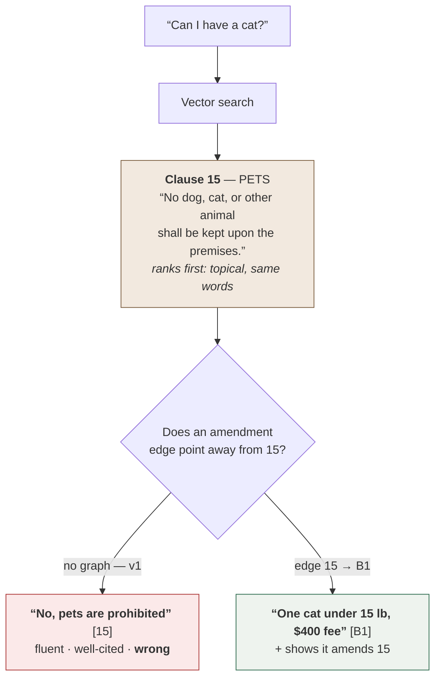

# Evals

```bash
# populate the database first
backend/.venv/bin/python backend/scripts/smoke_retrieval.py --reset
backend/.venv/bin/python evals/run_evals.py
```

Writes a Markdown report to `evals/reports/` and exits non-zero if any
non-override case fails. Override cases are expected to fail until M5, so they
don't break the run — they're the regression fixture that proves M5 works.

## The cases

35 cases in three files, all with ground truth derived from
`scripts/lease_content.py`, which also generates the PDFs — so expectations are
exact rather than hand-labelled.

| file | n | what it tests |
|---|---|---|
| `answerable.yaml` | 17 | the lease answers it; the right clause must be cited |
| `not_covered.yaml` | 13 | the lease is silent; refusing is the correct answer |
| `overrides.yaml` | 5 | an addendum changed the answer; citing the original is wrong |

The not-covered cases are the most valuable ones in the suite, and several are
deliberately adjacent to a topic the lease *does* cover — maple has pet clauses
but says nothing about pet insurance; birch says who pays for internet but not
who provides it. Retrieval always returns something, so passing requires
distinguishing "related" from "answers the question".

The override cases carry `must_not_cite`. Passing requires citing the amending
clause **and not** the superseded one — otherwise an answer that hedges by
citing both would pass, which in practice means telling a tenant their deposit
is either $2,100 or $3,150.

## Why the override cases are adversarial

The five override cases are the only ones where a *correct-looking* citation is
a failure. The lease says one thing, an addendum signed months later says
another, and the tenant asks the question in the original's vocabulary — so
retrieval's best match is exactly the clause that no longer governs.



The left branch is what makes these cases worth writing. It fails in the way
that matters most for a legal document — confidently, with a citation a tenant
would reasonably trust — and an eval that only compared answer text against a
keyword list would score it as a near-miss rather than a failure. So each of
these cases carries a `must_not_cite` on the superseded clause: citing 15 here
is wrong even if the prose happens to mention the addendum.

## Metrics

`retrieval_recall` and `citation_correctness` are reported separately on
purpose: they have different fixes. High recall with low citation correctness
means retrieval is fine and synthesis is choosing badly. Low recall means no
amount of prompt work will help.

`correct_refusal_rate` is never read alone — a system that refuses everything
scores 100%. It's only meaningful against `false_refusal_rate`, which is what
tightening the gate costs.

## The amendment graph, before and after

Same cases, same providers, same everything — the only change is that M5
populates the `amendments` table and retrieval walks it.

| metric | before M5 | after M5 |
|---|---|---|
| **override correctness** | **40%** | **100%** |
| citation correctness | 45% | 59% |
| retrieval recall | 91% | 91% |
| false refusal rate | 6% | 6% |
| passed | 12/35 | 15/35 |

The 40% before is the interesting number, not the 100% after. Two of the five
override cases passed with no amendment graph at all, purely because the
amending clause happened to outrank the clause it superseded. Retrieval was
right by accident, and a suite that only checked the final answer would have
reported those as working — which is why the override cases assert
`must_not_cite`, and why the trace keeps both clauses.

No regression in the other metrics is the other half of the claim: the graph
didn't buy override correctness by making the system refuse more or retrieve
worse.

## Baseline: offline providers (no API keys)

| metric | value |
|---|---|
| passed | 15/35 |
| retrieval recall | 91% |
| citation correctness | 59% |
| grounding pass rate | 100% |
| correct refusal rate | 15% |
| false refusal rate | 6% |
| override correctness | 100% |

Read this as a diagnosis, not a score. **Retrieval recall of 91% is the real
result** — clause-aware chunking finds the right clause almost every time,
including `14(b)` for an Airbnb question that shares no vocabulary with it, and
`2.1.1` three levels deep in the tree.

Everything else is bounded by the offline stand-ins. The extractive draft quotes
whatever ranked first, so it can't refuse; the lexical gate passes verbatim
quotes trivially, so it can't catch a topically-wrong answer. Hence 15% correct
refusal and a grounding pass rate of 100% that means nothing. Those two numbers
measure the placeholders, not the design.

Re-run with a real provider key in `.env` to get numbers that measure the
pipeline instead of its fallbacks.
